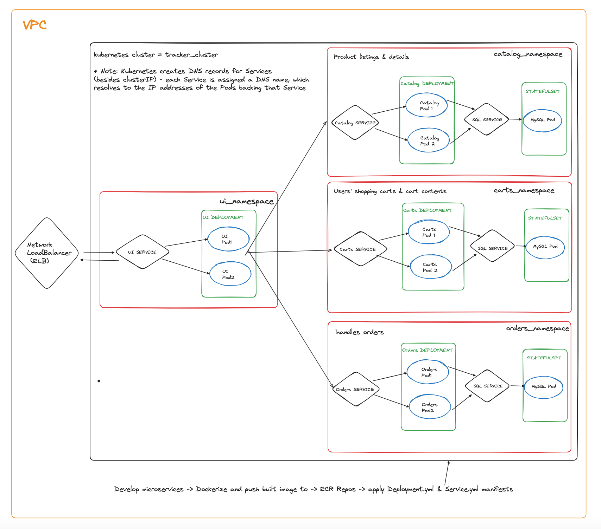

Tech stack:
- Fullstack: JavaScript, React, Node.js (Express), SQL (PostgreSQL)
- Devops: Amazon EKS (Kubernetes), Amazon ECR, Docker, Github Actions (CI/CD)

- Use `npm run create-cluster` to create EKS cluster (`eksctl create cluster --name <cluster-name> --region <region_mame> --fargate`)
- Make changes to your code 
- When code is committed to the main branch:
    - Git commit hash code is used to tag docker image
    - Docker images are built from Dockerfiles (runs npm run build to build app): tagged, built and pushed to ECR repository
    - Kubeconfig file is updated (organize information about clusters, users, namespaces, and authentication mechanisms)
    - Finally changes to application are deployed to Kubernetes cluster by applying the Service and Deployment Manifests
- To delete Kubernetes cluster: `npm run delete-cluster`

